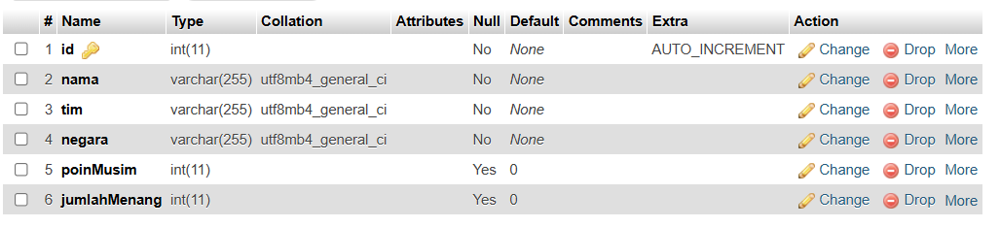
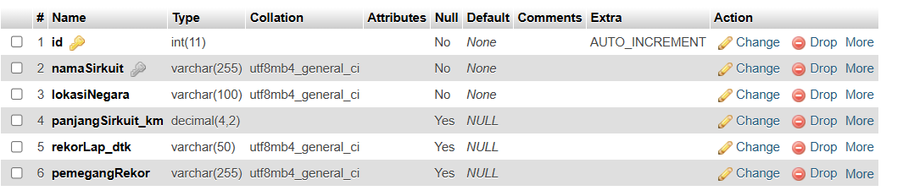

#### Janji
Saya Julia Rahmawati dengan NIM 2400742 mengerjakan tugas praktikum 9 dalam mata kuliah Desain dan pemrograman Berorientasi Objek untuk keberkahannya maka saya tidak melakukan kecurangan seperti yang telah di spesifikasikan. Aamiin.

#### Desain Program 
Program ini dibuat menggunakan arsitektur Model-View-Presenter untuk mengelola data pembalap dan sirkuit. Bahasa pemrograman yang di pakai adalah PHP. MVP adalah arsitektur yang memisahkan aplikasi menjadi tiga komponen yaitu, 
##### 1. Model 
Model adalah bagian yang menangani seluruh logika bisnis dan mengelola data. Tugasnya itu berinteraksi langsung dengan Database (CRUD), menyediakan data yang dibutuhkan presenter. Tugas model dalam program ini adalah, mengambil data dari database (getAll, getById), menambahkan, mengubah, dan mengahapus data, dan menangani operasi database melalui kelas kelas seperti: DB.php, KontrakPembalap.php, KontrakSirkuit.php, Pembalap.php, Sirkuit.php, TabelPembalap.php, TabelSirkuit.php. 
##### 2.View
View adalah bagian yang menangani tampilan dan interaksi langsung dengan pengguna. View hanya bertugas menampilkan data dan menerima input dari user tanpa memproses logika bisnis. Tugas View adalah : 
> menampilkan UI (tabel, form, dan tombol),
> Mengambil aksi pengguna seperi tambah, edit dan hapus,
> menerima data dari presenter dan menampilkan ke pengguna.
##### 3. Presenter
Presenter adalah penghubung antara View dan Model. Tugas Presenter yaitu:
> Menerima aksi dari view, seperti tambah pembalap.
> memvalidasi inputan misalnya, nama tidak kosong
> setelah validasi presenter memanggil model yang sesuai
> setelah selesai, presenter mengambil hasil sukes/ gagal dan memberikan perintah view untuk memperbarui data.

#### Database
##### 1. Tabel : pembalap

##### 2. Tabel : sirkuit

